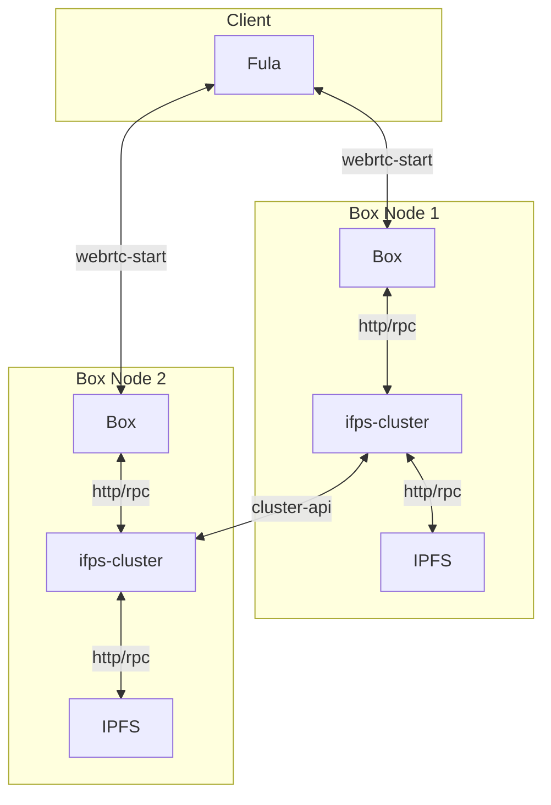

# Getting Started

This project demonstrate how two Boxes can create a cluster and replicated data for High Availability and data loss resilience.

## Components
- `go-ipfs` using as underling ipfs for storing data
- `ipfs-cluster` handle pinset on cluster of ipfs-node
- `box` have file and graphql protocol that will pin its data on ipfs-cluster

## Overview
This diagram show how every component interact.


## Usage

### Linux

1. Create cluster and network secret keys.

```shell
cd config
echo -e "/key/swarm/psk/1.0.0/\n/base16/\n`tr -dc 'a-f0-9' < /dev/urandom | head -c64`" > swarm.key
export CLUSTER_SECRET=$(echo "`tr -dc 'a-f0-9' < /dev/urandom | head -c64`")
```

2. Start docker-compose so it will init Box, IPFS and IPFS-Cluster nodes for Box0 and Box1

```
```shell
docker-compose up -d
```

3. View the logs to ensure everything has started.

```shell
docker-compose logs -f
```


### macOS

1. Create cluster and network secret keys.

```shell
cd config
export CLUSTER_SECRET=$(docker run -it -v "$(pwd)":/config $(docker build -q -t sec-gen .))
```

2. Start docker-compose so it will init Box, IPFS and IPFS-Cluster nodes for Box0 and Box1

```shell
docker-compose up -d
```

3. There is an issue with MDNS on Apple M1 chips.  To work around it disable MDNS.  Find the MDNS entry in `./data/ipfs[0|1]/config` and disable it.

```
 "Discovery": {·
  "MDNS": {·
-    "Enabled": true,·
+    "Enabled": false,·
    "Interval": 10·
    }·
  },·
```

Now run start the docker services again to start the failing services.

```shell
docker-compose up -d
```

See the steps below on manual peer discovery to enable each Box to find one another.

4. View the logs to ensure everything has started.

```shell
docker-compose logs -f
```

Wait for the IPFS nodes to be ready.

### Manual peer discovery
We're using MDNS so that the docker-compose network IPFS node and IPFS-Cluster will find each other but in case you want to do it manually here it is:

Before we start we need to find out the IPFS `PeerID`s.  You can find the IPFS `PeerID`s under:

`./data/ipfs0/config` and `./data/ipfs1/config`

There should be something like this:

```
  "Identity": {
    "PeerID": "12D3KooWPoCoCXKz8TMUVQhq52MqSFBAoHb9Vp9vzRQySNb4KoXw",
    "PrivKey": "CAESQG8Init402tgQA68GcaIGUZhqhnDAQUEE75vDpjr2im6z7dwl2/m8Bq2Fm7MdJn/FkeWxhrMUOtI0yv5hc25cHo="
  },
```

in this example the `PeerID` would be `12D3KooWPoCoCXKz8TMUVQhq52MqSFBAoHb9Vp9vzRQySNb4KoXw`.

Now add the ipfs1 PeerId as a bootstrap node to ipfs0:

```shell
docker-compose exec ipfs0 ipfs bootstrap add /dns4/ipfs1/tcp/4001/p2p/[PeerID of ipfs1]
```

You should see the following IPFS cmd line output if it worked:

```
added /dns4/ipfs1/tcp/4001/p2p/12D3KooWH1xqiPG7w8kGcmwgPGYYPrvejGXr7jwAKj6j3rJCff3A
```

Our configuration is done !
