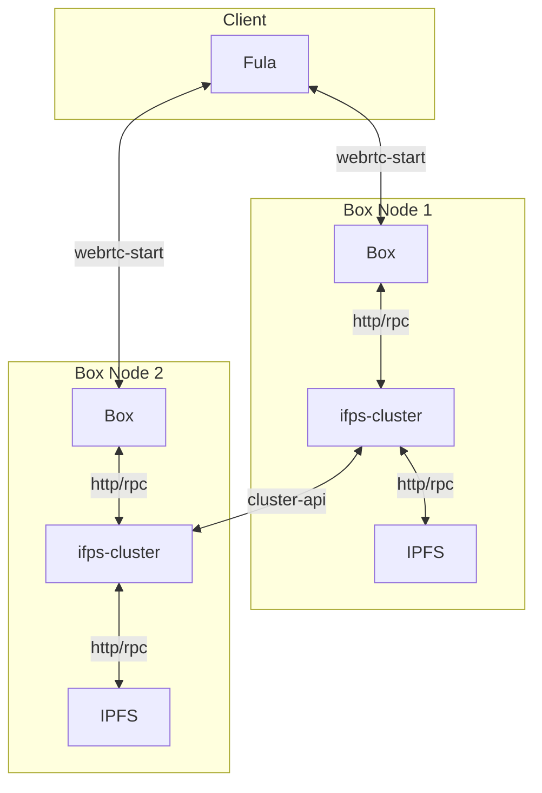

# Getting Started

This project demonstrate how two Boxes can create a cluster and replicated data for High Availability and data loss resilience.

## Components
- `go-ipfs` using as underling ipfs for storing data
- `ipfs-cluster` handle pinset on cluster of ipfs-node
- `box` have file and graphql protocol that will pin its data on ipfs-cluster

## Overview
This diagram show how every component interact.


## Usage
First step let's create cluster and network secret keys:
```shell
cd config
echo -e "/key/swarm/psk/1.0.0/\n/base16/\n`tr -dc 'a-f0-9' < /dev/urandom | head -c64`" > swarm.key
export CLUSTER_SECRET=$(echo "`tr -dc 'a-f0-9' < /dev/urandom | head -c64`")
```
Now we start docker-compose so its init our ipfs and ipfs-cluster nodes
```shell
docker-compose up -d
```
Wait for a minutes and stop the services so we config them manually
```shell
docker-compose down -v
```
Before we start we need to find out ipfs and box peerIds. you can find ipfs peer ids under
`./data/ipfs0/config` and `./data/ipfs1/config`
there should be something like this:
```
  "Identity": {
    "PeerID": "12D3KooWPoCoCXKz8TMUVQhq52MqSFBAoHb9Vp9vzRQySNb4KoXw",
    "PrivKey": "CAESQG8Init402tgQA68GcaIGUZhqhnDAQUEE75vDpjr2im6z7dwl2/m8Bq2Fm7MdJn/FkeWxhrMUOtI0yv5hc25cHo="
  },
```
in this example PeerID would be `12D3KooWPoCoCXKz8TMUVQhq52MqSFBAoHb9Vp9vzRQySNb4KoXw`.
and for the box you should look under `data/box0/data/identity.json` and `data/box1/data/identity.json` there should be somthing like this
```json
{"id":"QmNtZJ4bW3Kq7rQDzGMTeLW2bt9kgFwuNuKRDNynj8fxY1","privKey":"CAASpgkwggSiAgEAAoIBAQDYijKbTWFdtBn8VEAmTS9fVIRFQjk0T21xqcB2JPxnWuzKe2LcJXL/VOS9Q+QTuKf9UwibC7QmkK3/kXtqDtTPeDuFSKKVJXD9/8jvhCRde6DzFg1LVfJ+klA7hUpSd3onCeq9p26ffexCwzIuA8xOaPbqEWYhl9M71Q25MzQUHWrFir8aD8iVPR0a5nfv8AyhY3RZEAI2YFs7nw0jL9Ln/g2GxoH4RjrWTzZAm2TrkuN+014ZpPwfQR8OWumgWtkNdND4tPtW0QiveuW7R2Cj4JG0Hgpapxu22Nlll2lTRlDbyQwOQEmzXXfPTUaYbt8CVmL1Ma4m/WbSTCibnDbXAgMBAAECggEAMOWsHdOwa+dygr9HqR5+1wkPwU/9+OkCrssFUehyMqiele6c2Vd/i1bRPEfrZeSp0pOAevp+mMLM98wTUVS+C4d78VIAnKtSw5iR+DwfthhntNzC7cMfuiMyCO7FZK/kHpKntmHrogpeYokPeMKUzRP4xcxeArH1Giq3KZ39YZkEXxp9z08GJLlOSEH0dMT+PM6wK623wv4lD3S74NQLKTj0+AoBT+u2/4PUaVmYLOQDjJehgp7u+MZQWRy7MI820frKYOIYNs50JtSna8xXtVLXDYJkalPo3QieDbB3fuo+FLAR2i9QFjBTX2jkZfwOIumHn6K+qbisWxToQpGiaQKBgQD8YxRMmz4qBn/+jgVjfTmebB7NrNE9VUlQomr6SE7tmw2nVyst350eIDtZRK70tfA02O+cglF28mqXTU48lvB8xDAKbZxUZUsSTcWaSSWDxZ1TUmCCnTii5DxETF1ZWiRlIGoIdXvJpqATf14bAVhmYLGQaACPm3F33LmI40inkwKBgQDbo7/dCkO/L9TjJ6lrGdNIwqZaajOam1geCBKlsSN+t04nTl0m2EZ13RJBd77zmatS51x6/eGVD2iLZY56d+TPTOQJTcPadcIt2lneMrzL3p3P2xlD6uLjKEhazCLGhGydnP4QaRcUEGZjXYsnY4fPBUER+226XJNRjCa+qKN2LQKBgCtkzaSuPG31WCRoPrzwVuvKIzGxuPgWpdhbVJFbxVZNBnfzINVuURFQ8WNTz9D7RyWO9wOt1FvjKjiBbiY0vXx2LtxcJDjOga3P+V2hnfWeEIK28ykB5y76lvIXPyWRvhg1DoYNzQ7Ku1Me3ws9m/lePqlZeF84lrXJGY1TprZJAoGAMAFWSgWYUQ0vRobArLv0Rg7lNRXJOZ2CYO36xWQ2EdgWqNij232hyNkMyGpXvf50R6ZxvCAJUf8QJoeH4JSb2gNARBhPGkxqqIL06W/Fe/moHGoS15lbBbMkPVQotaLz6m8JyKRvet8qwcUMSQuj/0dytW9yyCy7tjMftMQ/FfECgYAvpBjLrh3MdnJpSiNDEjgLcgo/ImBE1s5qCZZqEqt3402zaGi5FsPdLnFRL/PtcEGxBTX78MGRZhLLtyG1Hi+ihT21wJ39/LzrLWvIQi0Pd0gayT2GlDBJLDA4ktWsG8JCmJ/9/NtgmrU9d7ae8+ztVre4+/hYmnFbFFvYc51DPw==","pubKey":"CAASpgIwggEiMA0GCSqGSIb3DQEBAQUAA4IBDwAwggEKAoIBAQDYijKbTWFdtBn8VEAmTS9fVIRFQjk0T21xqcB2JPxnWuzKe2LcJXL/VOS9Q+QTuKf9UwibC7QmkK3/kXtqDtTPeDuFSKKVJXD9/8jvhCRde6DzFg1LVfJ+klA7hUpSd3onCeq9p26ffexCwzIuA8xOaPbqEWYhl9M71Q25MzQUHWrFir8aD8iVPR0a5nfv8AyhY3RZEAI2YFs7nw0jL9Ln/g2GxoH4RjrWTzZAm2TrkuN+014ZpPwfQR8OWumgWtkNdND4tPtW0QiveuW7R2Cj4JG0Hgpapxu22Nlll2lTRlDbyQwOQEmzXXfPTUaYbt8CVmL1Ma4m/WbSTCibnDbXAgMBAAE="}
```
box PeerId is `QmNtZJ4bW3Kq7rQDzGMTeLW2bt9kgFwuNuKRDNynj8fxY1` in this example.
now that we have all node peerid we can start by editing `./data/ipfs0/config`
you have to set bootstrap node for ipfs0:
```
  "Bootstrap": [
    "/dnsaddr/bootstrap.libp2p.io/p2p/QmNnooDu7bfjPFoTZYxMNLWUQJyrVwtbZg5gBMjTezGAJN",
    "/dnsaddr/bootstrap.libp2p.io/p2p/QmQCU2EcMqAqQPR2i9bChDtGNJchTbq5TbXJJ16u19uLTa",
    "/dnsaddr/bootstrap.libp2p.io/p2p/QmbLHAnMoJPWSCR5Zhtx6BHJX9KiKNN6tpvbUcqanj75Nb",
    "/dnsaddr/bootstrap.libp2p.io/p2p/QmcZf59bWwK5XFi76CZX8cbJ4BhTzzA3gU1ZjYZcYW3dwt",
    "/ip4/104.131.131.82/tcp/4001/p2p/QmaCpDMGvV2BGHeYERUEnRQAwe3N8SzbUtfsmvsqQLuvuJ",
    "/ip4/104.131.131.82/udp/4001/quic/p2p/QmaCpDMGvV2BGHeYERUEnRQAwe3N8SzbUtfsmvsqQLuvuJ"
  ],
```
To 
```
  "Bootstrap": [
    "/dns4/ipfs1/tcp/4001/p2p/[PeerID of ipfs1]"
  ],
```
and you have to set bootstrap node for ipfs1 in `./data/ipfs0/config`:
```
  "Bootstrap": [
    "/dnsaddr/bootstrap.libp2p.io/p2p/QmNnooDu7bfjPFoTZYxMNLWUQJyrVwtbZg5gBMjTezGAJN",
    "/dnsaddr/bootstrap.libp2p.io/p2p/QmQCU2EcMqAqQPR2i9bChDtGNJchTbq5TbXJJ16u19uLTa",
    "/dnsaddr/bootstrap.libp2p.io/p2p/QmbLHAnMoJPWSCR5Zhtx6BHJX9KiKNN6tpvbUcqanj75Nb",
    "/dnsaddr/bootstrap.libp2p.io/p2p/QmcZf59bWwK5XFi76CZX8cbJ4BhTzzA3gU1ZjYZcYW3dwt",
    "/ip4/104.131.131.82/tcp/4001/p2p/QmaCpDMGvV2BGHeYERUEnRQAwe3N8SzbUtfsmvsqQLuvuJ",
    "/ip4/104.131.131.82/udp/4001/quic/p2p/QmaCpDMGvV2BGHeYERUEnRQAwe3N8SzbUtfsmvsqQLuvuJ"
  ],
```
To
```
  "Bootstrap": [
    "/dns4/ipfs0/tcp/4001/p2p/[PeerID of ipfs0]"
  ],
```
Now we have config our IPFS nodes time to config boxes. config for box1 and box2 located at
`./config/production0.json` and `./config/production1.json` open them and edit:
```json
{
  ...
  "nodes": [
    "/dns4/ipfs0/tcp/4001/ipfs/[PeerID of ipfs0]",
    "/dns4/ipfs1/tcp/4001/ipfs/[PeerID of ipfs1]",
    "/dns4/wrtc-star1.par.dwebops.pub/tcp/443/wss/p2p-webrtc-star/p2p/[PeerID of box0/box1]"
  ],
  ...
}
```
Our configuration is done get the cluster back online and enjoy it!
```
docker-compose up -d
```


