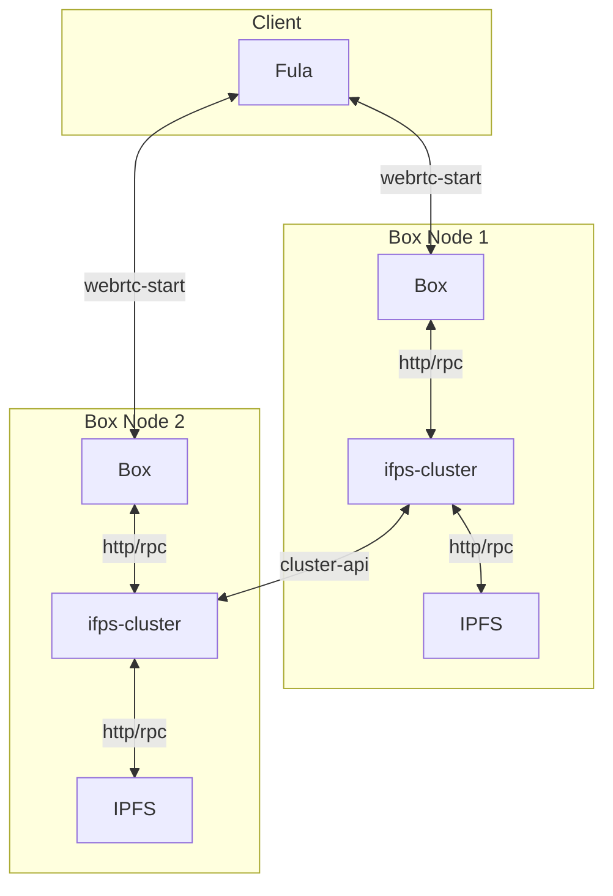

# Getting Started

This project demonstrate how two Boxes can create a cluster and replicated data for High Availability and data loss resilience.

## Components
- `go-ipfs` using as underling ipfs for storing data
- `ipfs-cluster` handle pinset on cluster of ipfs-node
- `box` have file and graphql protocol that will pin its data on ipfs-cluster

## Overview
This diagram show how every component interact.


## Usage
First step let's create cluster and network secret keys:
### Linux
```shell
cd config
echo -e "/key/swarm/psk/1.0.0/\n/base16/\n`tr -dc 'a-f0-9' < /dev/urandom | head -c64`" > swarm.key
export CLUSTER_SECRET=$(echo "`tr -dc 'a-f0-9' < /dev/urandom | head -c64`")
```
### macOS
```shell
cd config
export CLUSTER_SECRET=$(docker run -it -v "$(pwd)":/config $(docker build -q -t sec-gen .))
```
Now we start docker-compose so its init our ipfs and ipfs-cluster nodes
```shell
docker-compose up -d
```
U can see the logs by:
```shell
docker-compose logs -f
```
Wait for ipfs nodes to be ready.

### Manual peer discovery
We're using MDNS so in docker-compose network IPFS node and Cluster will find eche other but in case you want to do it manually here :

Before we start we need to find out ipfs peerIds. you can find ipfs peer ids under
`./data/ipfs0/config` and `./data/ipfs1/config`
there should be something like this:
```
  "Identity": {
    "PeerID": "12D3KooWPoCoCXKz8TMUVQhq52MqSFBAoHb9Vp9vzRQySNb4KoXw",
    "PrivKey": "CAESQG8Init402tgQA68GcaIGUZhqhnDAQUEE75vDpjr2im6z7dwl2/m8Bq2Fm7MdJn/FkeWxhrMUOtI0yv5hc25cHo="
  },
```
in this example PeerID would be `12D3KooWPoCoCXKz8TMUVQhq52MqSFBAoHb9Vp9vzRQySNb4KoXw`.
now add the ipfs1 as bootstrap node to ipfs0:
```shell
docker-compose exec ipfs0 ipfs boostrap add /dns4/ipfs1/tcp/4001/p2p/[PeerID of ipfs1]
```
Our configuration is done !


