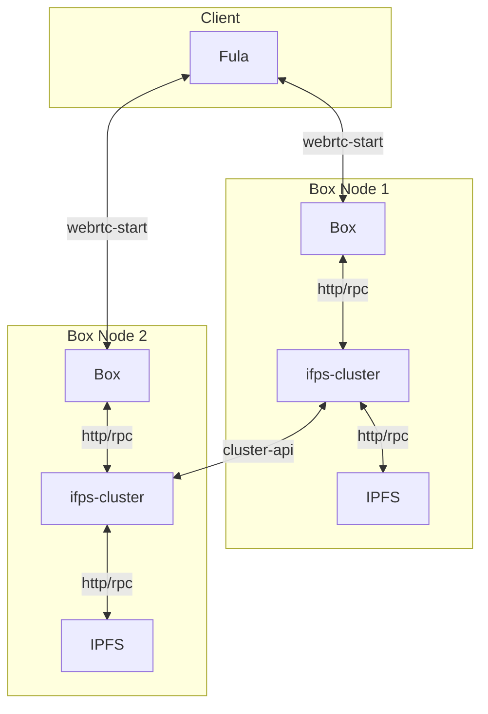

# Getting Started

This project demonstrate how two Boxes can create a cluster and replicated data for High Availability and data loss resilience.

## Components
- `go-ipfs` using as underling ipfs for storing data
- `ipfs-cluster` handle pinset on cluster of ipfs-node
- `box` have file and graphql protocol that will pin its data on ipfs-cluster

## Overview
This diagram show how every component interact.


## Usage
First step let's create cluster and network secret keys:
```shell
cd config
echo -e "/key/swarm/psk/1.0.0/\n/base16/\n`tr -dc 'a-f0-9' < /dev/urandom | head -c64`" > swarm.key
export CLUSTER_SECRET=$(echo "`tr -dc 'a-f0-9' < /dev/urandom | head -c64`")
```
Now we start docker-compose so its init our ipfs and ipfs-cluster nodes
```shell
docker-compose up -d
```
Wait for a minutes and stop the services so we config them manually
```shell
docker-compose down -v
```
Before we start we need to find out ipfs and box peerIds. you can find ipfs peer ids under
`./data/ipfs0/config` and `./data/ipfs1/config`
there should be something like this:
```
  "Identity": {
    "PeerID": "12D3KooWPoCoCXKz8TMUVQhq52MqSFBAoHb9Vp9vzRQySNb4KoXw",
    "PrivKey": "CAESQG8Init402tgQA68GcaIGUZhqhnDAQUEE75vDpjr2im6z7dwl2/m8Bq2Fm7MdJn/FkeWxhrMUOtI0yv5hc25cHo="
  },
```
in this example PeerID would be `12D3KooWPoCoCXKz8TMUVQhq52MqSFBAoHb9Vp9vzRQySNb4KoXw`.
now that we have all node peerid we can start by editing `./data/ipfs0/config`
you have to set bootstrap node for ipfs0:
```
  "Bootstrap": [
    "/dnsaddr/bootstrap.libp2p.io/p2p/QmNnooDu7bfjPFoTZYxMNLWUQJyrVwtbZg5gBMjTezGAJN",
    "/dnsaddr/bootstrap.libp2p.io/p2p/QmQCU2EcMqAqQPR2i9bChDtGNJchTbq5TbXJJ16u19uLTa",
    "/dnsaddr/bootstrap.libp2p.io/p2p/QmbLHAnMoJPWSCR5Zhtx6BHJX9KiKNN6tpvbUcqanj75Nb",
    "/dnsaddr/bootstrap.libp2p.io/p2p/QmcZf59bWwK5XFi76CZX8cbJ4BhTzzA3gU1ZjYZcYW3dwt",
    "/ip4/104.131.131.82/tcp/4001/p2p/QmaCpDMGvV2BGHeYERUEnRQAwe3N8SzbUtfsmvsqQLuvuJ",
    "/ip4/104.131.131.82/udp/4001/quic/p2p/QmaCpDMGvV2BGHeYERUEnRQAwe3N8SzbUtfsmvsqQLuvuJ"
  ],
```
To 
```
  "Bootstrap": [
    "/dns4/ipfs1/tcp/4001/p2p/[PeerID of ipfs1]"
  ],
```
and you have to set bootstrap node for ipfs1 in `./data/ipfs0/config`:
```
  "Bootstrap": [
    "/dnsaddr/bootstrap.libp2p.io/p2p/QmNnooDu7bfjPFoTZYxMNLWUQJyrVwtbZg5gBMjTezGAJN",
    "/dnsaddr/bootstrap.libp2p.io/p2p/QmQCU2EcMqAqQPR2i9bChDtGNJchTbq5TbXJJ16u19uLTa",
    "/dnsaddr/bootstrap.libp2p.io/p2p/QmbLHAnMoJPWSCR5Zhtx6BHJX9KiKNN6tpvbUcqanj75Nb",
    "/dnsaddr/bootstrap.libp2p.io/p2p/QmcZf59bWwK5XFi76CZX8cbJ4BhTzzA3gU1ZjYZcYW3dwt",
    "/ip4/104.131.131.82/tcp/4001/p2p/QmaCpDMGvV2BGHeYERUEnRQAwe3N8SzbUtfsmvsqQLuvuJ",
    "/ip4/104.131.131.82/udp/4001/quic/p2p/QmaCpDMGvV2BGHeYERUEnRQAwe3N8SzbUtfsmvsqQLuvuJ"
  ],
```
To
```
  "Bootstrap": [
    "/dns4/ipfs0/tcp/4001/p2p/[PeerID of ipfs0]"
  ],
```
Our configuration is done get the cluster back online and enjoy it!
```
docker-compose up -d
```


