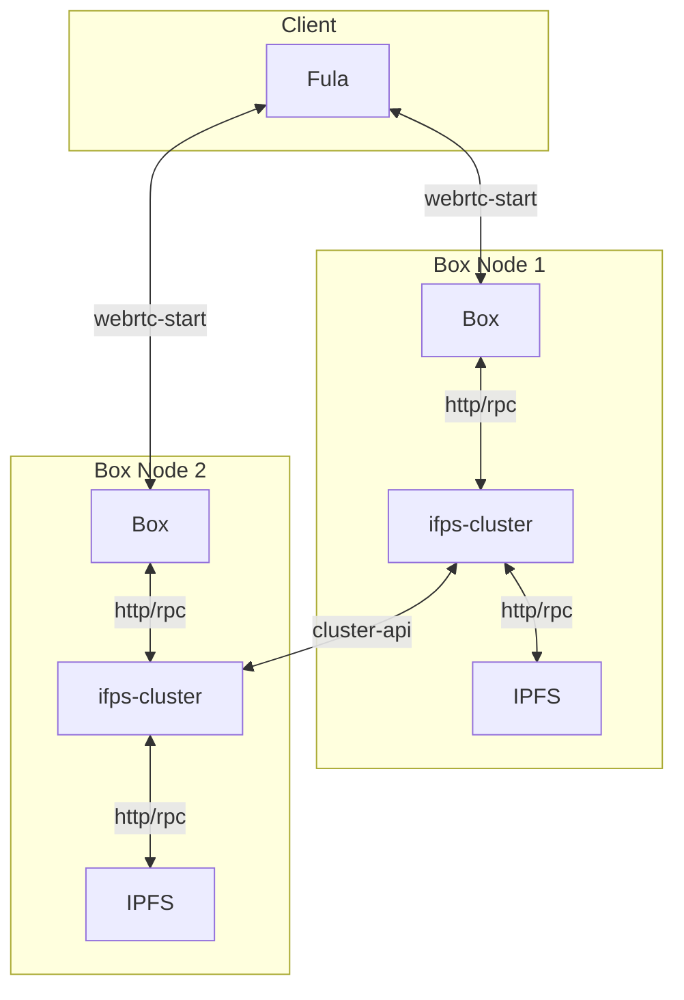

# Box Cluster Setup using Docker

The accompanying docker-compose demonstrates how two Boxes can be provisioned using Docker for development / testing of high availability / data loss resilience use cases.

This setup is mainly for running on development host machines (tested on OSX / Linux intel).

Note: It will not work on ARM (eg/ Raspbery Pi 4) architectures.

## Components
- `go-ipfs` using as underling ipfs for storing data
- `ipfs-cluster` handle pinset on cluster of ipfs-node
- `box` have file and graphql protocol that will pin its data on ipfs-cluster

## Overview

This diagram show how every component interact.



## Usage

1. Create a cluster secret environment variable.

### Linux:

```shell 
cd config
export CLUSTER_SECRET=$(echo "`tr -dc 'a-f0-9' < /dev/urandom | head -c64`")
```

### macOS

```shell
cd config
export CLUSTER_SECRET=$(docker run -it -v "$(pwd)":/config $(docker build -q -t sec-gen .))
```

2. Start docker-compose so it will init Box, IPFS and IPFS-Cluster nodes for Box0 and Box1

```
```shell
docker-compose up -d
```

3. View the logs to ensure everything has started.

```shell
docker-compose logs -f
```

4. Verify the cluster peers have connected (see step 4 of manual peer discovery)


## Troubleshooting on macOS

There is an issue with MDNS on Apple M1 chips that might cause cluster to not startup properly.

Even if it does startup properly, you will still probably  have to follow the steps below on 'manual peer discovery' since the MDNS interface is still not available.

To work around the startup issue, disable MDNS.  Find the MDNS entry in `./data/ipfs[0|1]/config` and edit it as follows:

```
 "Discovery": {·
  "MDNS": {·
-    "Enabled": true,·
+    "Enabled": false,·
    "Interval": 10·
    }·
  },·
```

Now run the docker services again to start the failing services.

```shell
docker-compose up -d
```

See the steps below on manual peer discovery to enable each Box to find one another.


### Manual peer discovery

In case you have to disable MDNS (see osx setup above), perform these steps to enable each IPFS-Cluster peer to find one another.

1. Find out the `multiaddress` for cluster1

```shell
docker exec -it cluster1 ipfs-cluster-ctl id
```

Output:

```shell
12D3KooWM9YXCZMpwxvpvgNzSuni6M2YWxVfKBdPFzB5bLJwKbrn | cluster1 | Sees 0 other peers
  > Addresses:
    - /ip4/127.0.0.1/tcp/9096/p2p/12D3KooWM9YXCZMpwxvpvgNzSuni6M2YWxVfKBdPFzB5bLJwKbrn
    - /ip4/172.19.0.4/tcp/9096/p2p/12D3KooWM9YXCZMpwxvpvgNzSuni6M2YWxVfKBdPFzB5bLJwKbrn
  > IPFS: 12D3KooWLr7huRnGw3iuYQZga45nkYQaQyjj5rMrho1dUW7Ly7TD
    - /ip4/127.0.0.1/tcp/4001/p2p/12D3KooWLr7huRnGw3iuYQZga45nkYQaQyjj5rMrho1dUW7Ly7TD
    - /ip4/127.0.0.1/udp/4001/quic/p2p/12D3KooWLr7huRnGw3iuYQZga45nkYQaQyjj5rMrho1dUW7Ly7TD
    - /ip4/172.19.0.2/tcp/4001/p2p/12D3KooWLr7huRnGw3iuYQZga45nkYQaQyjj5rMrho1dUW7Ly7TD
    - /ip4/172.19.0.2/udp/4001/quic/p2p/12D3KooWLr7huRnGw3iuYQZga45nkYQaQyjj5rMrho1dUW7Ly7TD
```

2. Either use the non loopback ip address (172) or change it to a  dns address so that when restarting the container you won't have to change the peer store in the next step each time.

In this example the dns4 multiaddr would be -

```
/dns4/cluster1/tcp/9096/p2p/12D3KooWM9YXCZMpwxvpvgNzSuni6M2YWxVfKBdPFzB5bLJwKbrn·
```

3. Add the cluster1 multiaddr to the peer addresses list in the cluster0 config under `data/cluster0/service.json`.

Now add the ipfs1 PeerId as a bootstrap node to ipfs0:

```shell
  "peer_addresses": [
    "/dns4/cluster1/tcp/9096/p2p/12D3KooWM9YXCZMpwxvpvgNzSuni6M2YWxVfKBdPFzB5bLJwKbrn"
  ]
```

4. Verify the clusters are connected.

```shell
docker exec -it cluster1 ipfs-cluster-ctl id
```

Sample output demonstrating cluster peers have connected:

```shell
12D3KooWM9YXCZMpwxvpvgNzSuni6M2YWxVfKBdPFzB5bLJwKbrn | cluster1 | Sees 1 other peers
  > Addresses:
    - /ip4/127.0.0.1/tcp/9096/p2p/12D3KooWM9YXCZMpwxvpvgNzSuni6M2YWxVfKBdPFzB5bLJwKbrn
    - /ip4/172.19.0.4/tcp/9096/p2p/12D3KooWM9YXCZMpwxvpvgNzSuni6M2YWxVfKBdPFzB5bLJwKbrn
  > IPFS: 12D3KooWLr7huRnGw3iuYQZga45nkYQaQyjj5rMrho1dUW7Ly7TD
    - /ip4/127.0.0.1/tcp/4001/p2p/12D3KooWLr7huRnGw3iuYQZga45nkYQaQyjj5rMrho1dUW7Ly7TD
    - /ip4/127.0.0.1/udp/4001/quic/p2p/12D3KooWLr7huRnGw3iuYQZga45nkYQaQyjj5rMrho1dUW7Ly7TD
    - /ip4/172.19.0.2/tcp/4001/p2p/12D3KooWLr7huRnGw3iuYQZga45nkYQaQyjj5rMrho1dUW7Ly7TD
    - /ip4/172.19.0.2/udp/4001/quic/p2p/12D3KooWLr7huRnGw3iuYQZga45nkYQaQyjj5rMrho1dUW7Ly7TD
```

Notice it says 'Sees 1 other peers' and not 'Sees 0 other peers'
